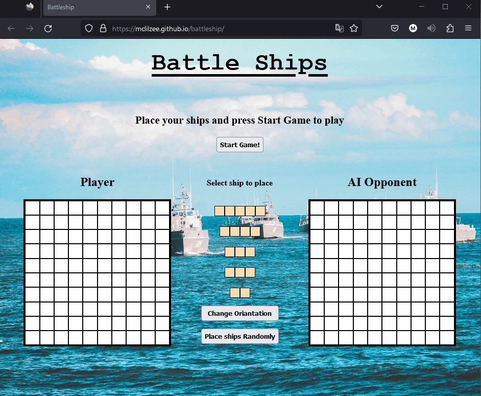
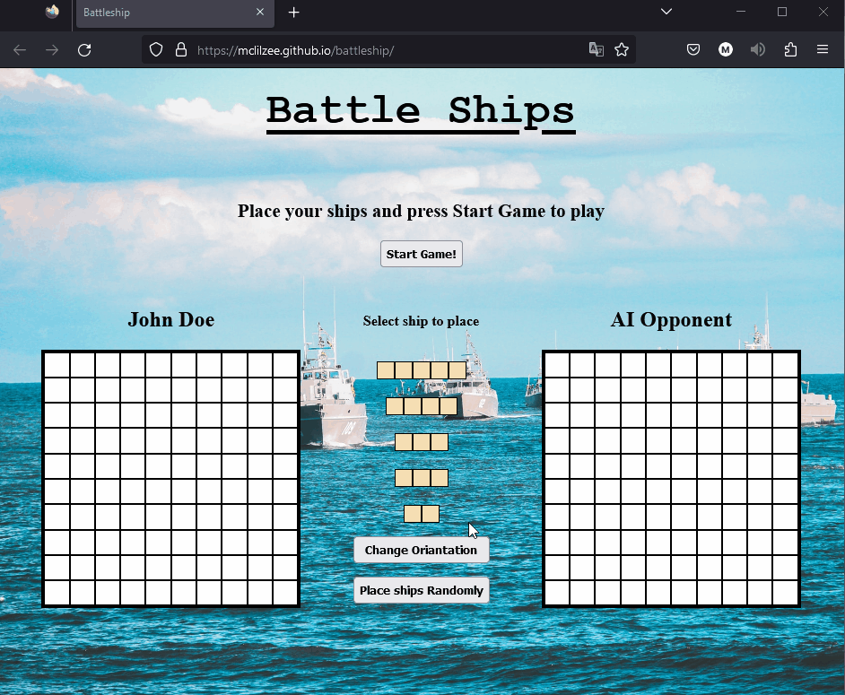

# <a href="https://mclilzee.github.io/battleship/">Battle Ships</a>
Everyone favorite childhood game, battle ships. It was one of those games that you use to play with your cousins and most likely cheat telling them that they didn't hit your ship.

Look no further, its now brought to the web with a simple click on the title you will travel back in time and start playing your fav game againts an AI.
A game of battleship

You will be able to choose your ships strategy, position them, select your name, and start a game! more will be shown in the examples.
  

# Examples

### Renaming

### Placing Ships

### Shooting Ship Position

### AI Tactics
As you can see the AI is not so dumb, the AI will actually choose adjasunt positions to attack your ships properly.

# Credits
Background Image by <a href="https://unsplash.com/@asaelamaury?utm_source=unsplash&utm_medium=referral&utm_content=creditCopyText">Asael Peña</a> on <a href="https://unsplash.com/s/photos/battle-ship?utm_source=unsplash&utm_medium=referral&utm_content=creditCopyText">Unsplash</a>
